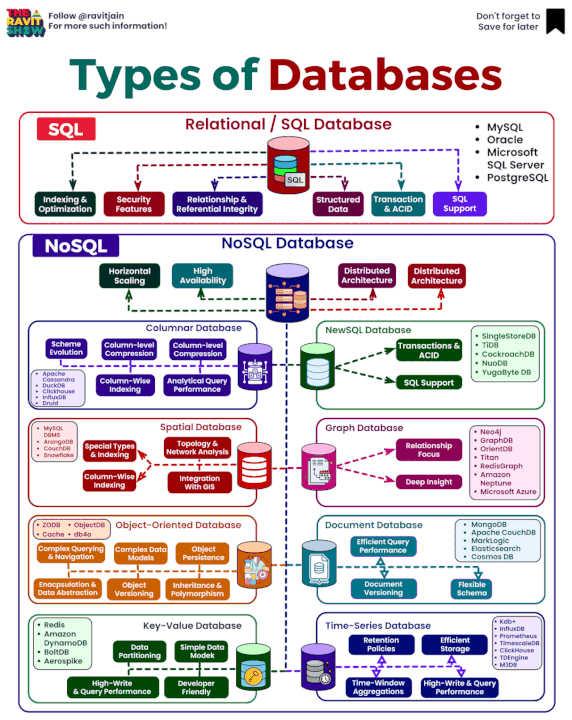

# Course Checkpoint 20

## What is redux?


Comenzaste a desarrollar aplicaciones en él. ¿Pero qué es? Observa cómo a medida que su aplicación se expande, se vuelve cada vez más difícil monitorear el estado actual, es difícil monitorear cuándo y qué componentes se renderizan, cuándo no se renderizan y por qué no se renderizan, es difícil monitorear el flujo de cambiando datos. Para eso está la biblioteca Redux. React en sí, aunque liviano, requiere mucho aprendizaje para desarrollarse cómodamente en él.

### Motivación para usar Redux

El mecanismo de almacenamiento de componentes local que viene con la biblioteca base (React) es inconveniente porque dicho almacenamiento está aislado. Por ejemplo, si desea que diferentes componentes independientes reaccionen a un evento, tendrá que pasar el estado local como accesorios a los componentes secundarios o propagarlo hasta el componente principal más cercano. En ambos casos no es conveniente hacer esto. El código se vuelve más confuso, más difícil de leer y los componentes se vuelven dependientes de su anidamiento. Redux resuelve este problema porque todo el estado está disponible para todos los componentes sin mucha dificultad.

Redux es una herramienta de desarrollo universal y se puede utilizar junto con varias bibliotecas y marcos.

### Instalar Redux y comenzar

```
npm install redux
```

Lo más probable es que esté utilizando la carpeta src donde está almacenado su código base. Los archivos relacionados con redux generalmente se almacenan en una carpeta separada. Para hacer esto, uso la carpeta /src/store, que almacena todo lo relacionado con Redux y el almacenamiento de aplicaciones. Puedes nombrarlo de manera diferente o colocarlo en una ubicación diferente.

```
.store
├── actionCreators
│ ├── action_1.js
│ └── action_2.js
├── actions
│ ├── action_1.js
│ └── action_2.js
├── reducers
│ ├── reducer_1.js
│ ├── reducer_2.js
│ └── rootReducer.js
├── initialState.js
└── store.js
```

### Redux

#### createStore

Una vez que haya creado la estructura básica para trabajar con el almacenamiento Redux, es hora de comprender cómo puede interactuar con él.

La tienda global de aplicaciones se crea en un archivo separado, que generalmente se llama store.js:

```JavaScript
// store.js
import { createStore } from 'redux';

const store = createStore(reducer);

export default store;
```

#### reducer()

reducer es una función pura que se encargará de actualizar el estado. Aquí se implementa la lógica según la cual se actualizarán los campos de la tienda.

Así es como se ve una función reductora básica:

```JavaScript
function reducer(state, action) {
    switch(action.type) {
        case ACTION_1: return { value: action.value_1 };
        case ACTION_2: return { value: action.value_2 };
        
        default: return state;
    }
}
```

La función toma el valor del estado actual y un objeto de evento (acción). Un objeto de evento contiene dos propiedades: el tipo de evento (action.type) y el valor del evento (action.value).

Por ejemplo, si necesita controlar el evento onChange para un campo de entrada, el objeto del evento podría verse así:

```
{
    type: "ACTION_1",
    value: "Form value"
}
```

Es posible que algunos eventos no necesiten pasar ningún valor. Por ejemplo, al procesar el evento onClick, podemos indicar que el evento ha ocurrido, que no se requieren más datos y cómo reaccionar ante él será descrito por la lógica incorporada directamente en el propio componente, que debería reaccionar ante él y parcialmente. en el reductor. Pero en todos los casos es necesario determinar el tipo de evento. El reductor parece preguntar: ¿qué pasó? actio.type es igual a "ACTION_1" sí, eso significa que ocurrió el evento número 1. Entonces es necesario procesarlo de alguna manera y actualizar el estado. Lo que devuelve el reductor será el nuevo estado.

ACTION_1 y ACTION_2 son constantes de eventos. Acciones de manera diferente.

Como habrás adivinado, la tienda puede almacenar una estructura de datos compleja que consta de un conjunto de propiedades independientes. Actualizar una propiedad dejará otras propiedades intactas. Entonces, según el ejemplo anterior, cuando ocurre el evento número uno (ACCIÓN_1), el campo número uno (valor_1) en la tienda se actualiza, mientras que el campo número dos (valor_2) permanece intacto. En general, el mecanismo es similar al método this.setState().

#### dispatch()

Para actualizar la tienda, debe llamar al método dispatch (). Se llama al objeto store que está creando en store.js. Este objeto es comúnmente llamado store por lo que la actualización de estado en mi caso es la siguiente:

```JavaScript
store.dispatch({ type: ACTION_1, value_1: "Some text" });
```

ACTION_1 es una constante de evento de la que vamos a ir más allá.

Esta función llamará a la función reducer que procesará el evento y actualizará los campos de almacenamiento correspondientes.

#### actionCreator()

De hecho, pasar un objeto de evento directamente a dispatch () es un signo de mal tono. Para ello, debe utilizar una función llamada actionCreator. Ella está haciendo exactamente lo que se espera. ¡Crea un evento! La llamada a esta función debe pasar como argumento a dispatch y en actionCreator pasar el valor requerido (value). La acciónCreator básica es la siguiente:

```JavaScript
function action_1(value) {
    return { 
        type: ACTION_1,
        value_1: value
    };
}

export default action_1;
```

De esta manera, la llamada dispatch debe verse así:

```JavaScript
store.dispatch(action_1("Some value"));
```

Con el uso de actionCreator, el código se vuelve más limpio.

#### Actions

las acciones son constantes que describen el evento. Normalmente es simplemente una cadena con el nombre del evento descriptivo. Por ejemplo, la constante que describe el evento número uno será la siguiente:

```JavaScript
const ACTION_1 = "ACTION_1";

export default ACTION_1;
```

De nuevo, en el proyecto deberías llamar a las constantes según el evento que describe: onClick, createUserSesion, deleteItem, addItem, etc. Lo principal es que se entienda. Tenga en cuenta que no escribí nada, así que recuerde importar sus constantes antes de usarlas. Porque las constantes también se suelen dividir en archivos individuales almacenándolos en una carpeta especial. Aunque algunos los almacenan en un solo archivo llamado actionTypes.js. Tal decisión no puede ser calificada como no correcta, pero tampoco como perfecta.

#### getState()

Con dispatch () actualizado, ¿y ahora cómo ver el nuevo valor de la tienda? No hace falta inventar nada, hay un método getState (). También se llama al método dispatch en una instancia del objeto store. Por lo tanto, para mi ejemplo, una llamada

```JavaScript
store.getState()
```

devolverá el valor de los campos de almacenamiento. Por ejemplo, para ver el valor del campo value_1 será necesario llamar

```JavaScript
store.getState().value_1
```

#### subscribe()

¿Cómo puedo saber cuándo se actualizó? Para ello existe el método subscribe (). También se llama en una instancia de store. Este método acepta una función que se llamará cada vez que se actualice la tienda. Es como «firmar» la función que se le pasa para la actualización. Por ejemplo, el siguiente código, cada vez que se actualice (cada vez que se llame a dispatch ()), mostrará un nuevo valor de store en la consola.

```JavaScript
store.subscribe(() => console.info(store.getState()))
```

Este método devuelve la función unsubscribe (). Lo que le permite «darse de baja de la actualización». Por ejemplo, si elimina un componente de DOM, debe cancelar sus métodos de actualización en componentWillUnmount (). Este método de ciclo de vida se llama al desmontar un componente y es exactamente donde vale la pena darse de baja de la actualización. Simplemente en el destructor.

#### combineReducers()

combineReducers () le permite combinar varios reducers en uno.

Si la lógica de actualización de componentes es bastante compleja y\o si necesita manejar un gran número de diferentes tipos de eventos, el reducer raíz puede ser demasiado voluminoso. La mejor solución sería dividirlo en varios reducers individuales cada uno de los cuales es responsable de procesar sólo un tipo de evento y actualizar un campo específico.

Por ejemplo, si un reducer actualiza el campo número uno, puede que se vea así:

```JavaScript
function value_1(state, action) {
    switch(action.type) {
        case ACTION_1: return action.value_1;
        
        default: return state;
    }
}

export default value_1;
```

El nombre del reducer (value_1) muestra qué propiedad actualizará en la tienda. Si cambia el nombre a value_2, actualizará el value_2. ¡Así que ten esto en cuenta!

Cuando se utiliza un único reducer mostramos qué campo queremos actualizar:

```JavaScript
 case ACTION_1: return { value_1: action.value_1 };
```

Pero cuando has dividido tus reducers solo necesitas recuperar un nuevo valor:

```JavaScript
case ACTION_1: return action.value_1;
```

Ya que aquí no es necesario especificar que desde los campos actualiza el reducer para su nombre y hay un campo que actualiza.

#### initialState

initialState: objeto que representa el estado inicial del almacenamiento. Es el segundo argumento no obligatorio del método createStore (). Con la creación del almacén, puede declarar inmediatamente el estado inicial para sus campos. Es aconsejable crear este objeto, incluso cuando no se requieren declaraciones de estado inicial. Porque este objeto ayuda a mirar la estructura de la bóveda y el nombre de sus campos. El objeto initialState normal es el siguiente:

```JavaScript
const initialState = {
    date_1: "value...",
    date_2: "value..."
};

export default initialState;
```

En algunos casos (cuando un componente utiliza inmediatamente un valor de la tienda), su anuncio puede convertirse en obligatorio de lo contrario usted recibirá un error: TypeError: Cannot read property 'value _ 1' de undefined.

Además, los reducers siempre deben devolver el estado actual por defecto. Por ejemplo, si se utiliza un único reducer, el último valor del switch debe ser el siguiente:

```JavaScript
default: return store;
```

Si divide reducers en funciones independientes, entonces debe devolver el valor de esa propiedad de la que es responsable:

```JavaScript
default: return store.value_1;
```

También si no transfiere el objeto initialState a createStore, puede devolverlo desde el reducer. En ambos casos, se inicializará el estado inicial para la tienda.

### React-redux

Parecería que tenemos todo lo que podemos usar para Reducir. Pero en realidad, el uso de él sin el paquete Aprox-redux en las aplicaciones React no se ve muy bien.

#### Provider

Para utilizar el store en un componente, debe pasarlo a props:

```JavaScript
ReactDOM.render(<Main store={store} />, document.getElementById('root'));
```

Y después de usar en el componente: this.props.state. Para ello, react-redux prevé el método Provider:

```JavaScript
ReactDOM.render(
    <Provider store={store}>
        <Main />
    </Provider>, 
document.getElementById('root'));
```

De esta manera, el método connect podrá utilizar la tienda. De lo contrario, obtendrás el error: Error: Could not find «store» en el contexto de «Connect (Main)». Either wrap the root component in a , or pass a custom React context provider to and the corresponding React context consumer to Connect(Main) in connect options.

También puede pasar la tienda directamente al componente sin envolverlo en Provider y esto funcionará. Pero es mejor usar Provider.

#### mapStateToProps()

Este método se llama cada vez que se realiza una actualización de la tienda y es el que pasa las propiedades necesarias de la tienda al componente. Por ejemplo, el componente debe responder y actualizar la IU cada vez que el campo número uno (value_1) se haya actualizado. No necesita responder a la actualización de otros campos. Si no usas react-redux tendrías que usar el método subscribe () para aprender sobre la actualización y más adelante cómo comprobar si el campo número uno se ha actualizado o no. En general, no es difícil entender que tal código parecerá demasiado sucio y redundante. Con mapStateToProps (), puede definir claramente qué campos interesan al componente. Y a qué campos debe responder.

Volviendo al ejemplo anterior, si el componente uno necesita obtener el campo número uno (value_1) entonces mapStateToProps para él será el siguiente:

```JavaScript
function (state) {
    return {
        value_1: state.value_1
    };
}
```

Una vez dentro del componente, podemos acceder al campo value_1 a través de la this.props.value_1. Y cada vez que este campo se actualiza, el componente se vuelve a renderizar.

Puede crear una carpeta independiente en/src/store para almacenar archivos cada uno de los cuales contendrá la función mapStateToProps para todos sus componentes. O bien (como lo hice) utilizar la función de retorno de mapStateToProps para cada componente. Personalmente, me gusta este enfoque. Esta función es la siguiente:

```JavaScript
function mapStateToProps(component) {
    switch(component) {
        case "Component_1": {
            return function (state) {
                return {
                    value_1: state.value_1
                };
            }
        }
        case "Component_2": {
            return function(state) {
                return {
                    value_2: state.value_2
                };
            }
        }
        default: return undefined;
    }
}

export default mapStateToProps;
```

Esta función toma como argumento una cadena con el nombre del componente y devuelve la función mapStateToProps, que devuelve un objeto con la propiedad de store necesaria para un componente dado. Esta función puede llamarse mapStateToPropsGenerator ().

#### mapDispatchToProps()

Esta función transfiere métodos al componente para actualizar el campo store necesario. Cualquiera que sea la llamada dispatch directamente desde el componente que va a utilizar este método para pasar a props el método cuya llamada dará lugar a la llamada dispatch y la actualización del campo correspondiente. Es que ahora se verá más elegante y el código más claro y limpio.

Por ejemplo, el componente número uno debe ser capaz de actualizar el campo número uno de la tienda. Luego, mapDispatchToProps se verá como sigue:

```JavaScript
function (dispatch) {
    return {
        changeValue_1: bindActionCreators(action_1, dispatch)
    };
};
```

Ahora para actualizar la propiedad value_1 llamará a changeValue_1 () a través de this.props.changeValue_1 (valor). Sin llamar a dispatch directamente a través de this.props.store.dispatch (action_1 (valor)).

bindActionCreators debe importarse de redux. Permite envolver la función dispatch y actionCreator en un único objeto. Es posible que no utilice bindActionCreators, pero el código se verá redundante. Debe comenzar a implementar cualquier funcionalidad para que el código se recupere simple y miniatura. Por lo tanto, no se debe escribir nada extra.

Sólo un código limpio y comprensible. El método bindActionCreators (actionCreator, dispatch) acepta dos parámetros obligatorios es la función actionCreator de la que ya hemos hablado y dispatch. Devuelve un método para cambiar los campos de la tienda.

Al igual que para mapStateToProps, utilizo la función generador de la función de retorno mapDispatchToProps para cada componente:

```JavaScript
import { bindActionCreators } from 'redux';
import action_1 from './actionCreators/action_1';
import action_2 from './actionCreators/action_2';

function mapDispatchToProps(component) { 
    switch(component) {
        case "Component_1": return function(dispatch) {
            return {
                change_value_1: bindActionCreators(action_1, dispatch)
            };
        };
        case "Component_2": return function(dispatch) {
            return {
                change_value_2: bindActionCreators(action_2, dispatch)
            };
        };
        default: return undefined;
    }
}

export default mapDispatchToProps;
```

#### connect()

¡Ahora es el clímax! Eso no funcionará. Es una función connect.

Es la que asocia mapStateToProps y mapDispatchToProps con el componente y pasa los campos y métodos necesarios a él. Devuelve un nuevo componente de envoltura para su componente. No sé cómo nombrar correctamente un componente de este tipo, ya que en la documentación en sí no se describe esto. Personalmente, agrego la terminación _ w para los componentes de envoltorios. Como si fuera _ w = wrap Component. La conexión de un componente en un caso etm es la siguiente:

```JavaScript
const COMPONENT_1_W = connect(mapStateToProps("Component_1"), mapDispatchToProps("Component_1"))(Component_1);
```

Y ahora, en ReactDOM.render (), no pasas tu componente, sino el que devuelve la función connect.

Si el componente no necesita pasárselo a mapStateToProps o mapDispatchToProps, pase undefined o null a él.

## What is a SQL database?



### ¿Qué es la base de datos?

La base de datos (abreviada «DB») es una colección de datos organizada a la que se puede acceder fácilmente. Para gestionar las bases de datos se utilizan sistemas de gestión de bases de datos (abreviado «DBMS»).

Hay dos tipos comunes de bases de datos:

- No relacionales.

- Relacionales.

### DBMA no relacionales

En los DBMS no relacionales, los datos se almacenan en pares clave-valor. Por ejemplo:


Aquí los datos de los clientes se almacenan en pares clave-valor.

Populares DBMS no relacionales: MongoDB, Amazon DynamoDB, Redis, etc.

### DBMS relacionales

En los DBMS relacionales, los datos se almacenan en formato de tabla. Por ejemplo:


Aquí los clientes son una tabla dentro de la base de datos. La primera fila son los atributos de la tabla. Cada línea posterior contiene datos reales. En los DBMS relacionales, dos o más tablas pueden estar relacionadas entre sí. De ahí el término «relacional» (inglés: «relation» = «relation»). Por ejemplo:


Las tablas de clientes y pedidos están conectadas a través de customer_id. Para acceder a los datos de las bases de datos relacionales se utiliza SQL.

DBMS relacionales populares: MySQL, PostgreSQL, MSSQL, Oracle, etc.

### ¿Qué es SQL?

El lenguaje de consultas estructuradas (abreviado "SQL' del inglés" Structured Query Language ") es un lenguaje de consultas estándar utilizado para trabajar con bases de datos relacionales.

SQL se utiliza para:

- creación de bases de datos;

- crear tablas en la base de datos;

- leer datos de tablas;

- insertar datos en tablas;

- actualizaciones de datos en la tabla;

- eliminar datos de la tabla;

- eliminar tablas de base de datos;

- eliminación de bases de datos;

- muchas otras operaciones con bases de datos.

Considere el ejemplo del comando SQL:

```SQL
SELECT first_name, last_name FROM Customers;
```

Aquí seleccionamos (SELECT) el nombre y apellidos de todos los clientes de la tabla de clientes (FROM).


SQL se utiliza en todas las bases de datos relacionales como MySQL, Oracle, MSSQL, PostgreSQL, etc.

## Why do we use MySQL Workbench?

Al final del proceso de instalación, MySQL Workbench debe iniciarse automáticamente. Si no es así, inicie el programa manualmente. Usted es recibido por la herramienta de interfaz gráfica de usuario (GUI) para MySQL, MySQL Workbench.

En la mitad inferior de la ventana bajo «MySQL Connections» debería ver un mosaico para su conexión de instancia local, Local instance MySQL80.

- Adelante y haga doble clic en él.


- In the new window, enter the password you chose earlier and click “OK.”


Y estamos dentro. Ahora está conectado a MySQL Server y puede empezar a utilizar MySQL Workbench.


### Navegante

El Navegador normalmente se encuentra en el lado izquierdo de la GUI de MySQL Workbench. Sirve como un centro central para la gestión de bases de datos y la navegación. Alberga algunas características administrativas y una práctica estructura en forma de árbol de todas sus bases de datos en la pestaña «Esquemas».


### Pregunta

La pestaña «Consulta», ubicada en el centro del área de trabajo, es donde puede escribir y ejecutar consultas SQL. Aquí es donde interactúa con sus bases de datos MySQL utilizando comandos SQL.


### Salida

La pestaña «Salida», generalmente ubicada en la parte inferior de la interfaz MySQL Workbench, muestra varios tipos de información y comentarios. Esto incluye comentarios sobre la ejecución (exitosa) de sus consultas SQL, cualquier mensaje de error y actualizaciones de estado con respecto a su servidor MySQL.


### Prueba de la conexión

Para probar la conexión, siga estos pasos:

- En MySQL Workbench, abra una nueva pestaña de consulta haciendo clic en el icono «+ SQL» en la esquina superior izquierda o seleccionando «Archivo» > «Nueva pestaña de consulta».


Puede utilizar una consulta SQL básica para probar la conexión. Por ejemplo, puede ejecutar una consulta para mostrar la fecha y hora actuales:

```SQL
SELECT NOW();
```

Esta consulta recuperará la fecha y hora actuales del servidor MySQL. Si recibe un resultado con la fecha y hora actuales, confirma que su conexión al servidor MySQL está funcionando.

- Introduzca SELECT NOW () en la nueva ficha de consulta.
- Haga clic en el botón «Ejecutar» (símbolo de rayo) o pulse Ctrl + Entrar para ejecutar la consulta.


Si la consulta se ejecuta correctamente y ve la fecha y hora actuales en el panel de resultados, significa que la conexión al servidor MySQL funciona correctamente. Si obtiene un error o no ve ningún resultado, podría indicar un problema de conexión. En ese caso, vuelva a comprobar la configuración de la conexión, incluidos el nombre de host, el puerto, el nombre de usuario y la contraseña, y asegúrese de que el servidor MySQL se está ejecutando.

## What are some SQL Data Types?


### Números enteros

- TINYINT es un tipo de números enteros. Rango de valores de -127 a 128 (si puede ser negativo), o 0 a 255 (si no puede ser negativo).
- SMALLINT es un tipo de enteros, A diferencia de TINYINT, el rango de valores es significativamente mayor: -32 768 a 32 767 (si el valor puede ser negativo), o 0 a 65 535.
- MEDIUMINT es un tipo de enteros, sin embargo, el rango de valores es aún mayor: de -8 388 608 a 8 388 607 (si es posible negativo), o de 0 a 16 777 215.
- INT es un tipo de números enteros. El tipo de datos más común. Rango: de -2 147 483 648 a 2 147 483 647, o de 0 a 4 294 967 295.
- BIGINT es otro tipo de números enteros, con el rango de valores más amplio. Rara vez se utiliza, ya que una escala similar de valores es extremadamente rara. De -9 223 372 036 854 775 808 a 9 223 372 036 854 775 807, o de 0 a 18 446 744 073 709 551 615.

### Números reales

- FLOAT - números reales. La precisión es única. El número de signos después de la coma no puede ser superior a 24 horas. Rango de valores: de -3,402823466E + 38 a -1,175494351E-38, 0, y de 1,175494351E-38 a 3,402823466E + 38.
- DOUBLE es un tipo real de datos. Es similar a FLOAT, pero los signos después de coma son el doble. El número de signos después de la coma puede ser de hasta 53 x. Valores permitidos: -1,7976931348623157E + 308 a -2,2250738585072014E-308, 0, y de 2,2250738585072014E-308 a 1,7976931348623157E + 308.
- DECIMAL es un tipo de datos real, almacenado como una cadena. Se usa raramente. Si no hay signos, el rango de valores es el mismo que el de DOUBLE.

### Las líneas

- TEXT (BLOB) es un tipo de datos de cadena estándar. Longitud máxima de 65.535 caracteres.
- TINYTEXT (TINYBLOB) es un tipo de cadena. Texto con una longitud de 0 a 255 caracteres.
- MEDIUMTEXT (MEDIUMBLOB) es un tipo de cadena. Texto con una longitud de 0 a 16.777.215 caracteres.
- LONGTEXT (LONGBLOB) es un tipo de cadena. Texto con una longitud de 0 a 4 294 967 295 caracteres.
- VARCHAR es otro tipo de datos de cadena, con una cadena de longitud variable de 0 a 255 caracteres. Se utiliza con mayor frecuencia para guardar variables con login, contraseña y otros datos de usuario.
- CHAR es un tipo de datos de cadena. La longitud es fija (independientemente del número de caracteres transferidos). El rango es de 0 a 255 caracteres. Cuando los datos se transmiten con menos de 255 caracteres al final, los espacios se completan con los datos para que la longitud de la cadena alcance el tamaño especificado.

### Tipos de datos binarios

- TINYBLOB es un tipo de datos binarios. Máximo 255 caracteres.
- BLOB es un tipo binario. Máximo 65535 caracteres.
- MEDIUMBLOB es un tipo de datos binarios. Máximo 16.777.215 caracteres.
- LONGBLOB es un tipo de datos binarios. Máximo 4 294 967 295 caracteres.

### Fecha y hora

- DATE: tipo de datos que almacena la fecha. El formato es el siguiente: YYYY-MM-DD (año, mes, día). Por ejemplo, tal valor satisfaría este campo: 2011-01-02.
- DATETIME es un tipo de datos que almacena la fecha y la hora. El formato es el siguiente: YYYY-MM-DD HH: MM: SS (año-mes-día hora-minuto-segundo). Por ejemplo: 2011-01-21 09:41:22
- TIMESTAMP es un tipo de datos que almacena la fecha y la hora. Tiene los siguientes formatos: YYYYMMDDHHMMSS, YYMMDDHMMMSS, YYYYMMDD, YYMMDD.
- TIME es el tipo de datos que almacena el tiempo. Formato: HH: MM: SS. Por ejemplo: 09:21:55.
- YEAR: tipo de datos que almacena la fecha (año). Formatos: YY, YYYY.
